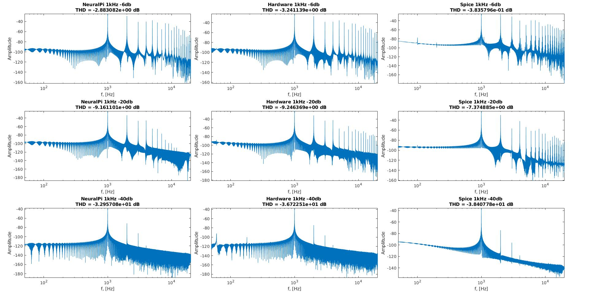
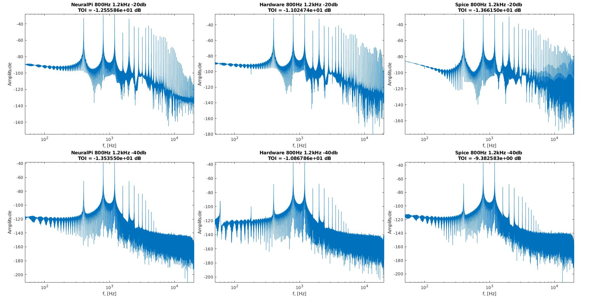
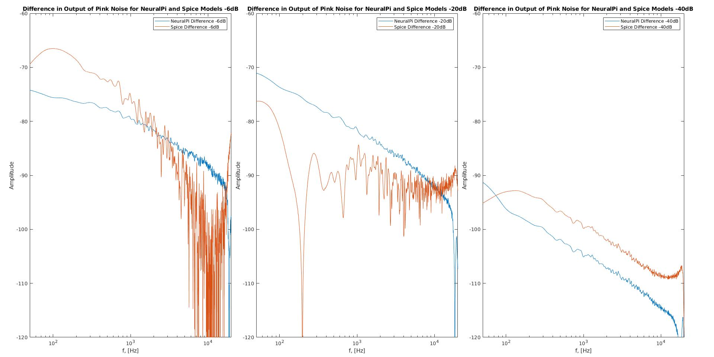

# MATLAB-Measurements
The following repository contains all the MATLAB code used to compare the analog hardware to the GuitarML model to the LTspice model. MATLAB scripts for measuring THD, TOI, and spectral wav processing. These measurements are used to analyze the effectiveness of GuitarML

Total harmonic distortion (THD) is a measurement of harmonic distortion present in a signal. It is defined as the ratio of the sum of the powers of all harmonic components over the power of the fundamental frequency. Lower THD in power systems means higher power factor, lower peak currents, and higher efficiency. In this project, the THD and frequency spectrum is one measurement used to find the "fingerprint" of the analog hardware. The THD is calcualted and frequency spectrum is plotted using the THD_Wav_Processing_100hz.m MATLAB file for the  sgnal going through the analog hardware, the LTspice Model, and the machine learned model. The closer the THD and the more the frequency spectrum matches the analog hardware, the better the LTspice and machine learned models are doing.

Third order intercept (TOI, also known as IM3) is a theoretical value calculated based on measured values. It is the most common measure of the linearity of a device. Generally, its use is that the higher TOI, the better the linearity and lower the level of intermodulation distortion. In this project, we are once again using this value and frequency spectrum as another "fingerprint" of the analog hardware. The TOI is calcualted and frequency spectrum is plotted using the TOI_Wav_Processing.m MATLAB file for the signal going through the analog hardware, the LTspice Model, andthe machine learned model. The closer the TOI and the more the frequency spectrum matches the analog hardware, the better the LTspice and machine learned models are doing.

To conduct spectral analysis, the Spectral_Wav_Processing.m MATLAB file is used. It takes the dirty output of the analog hardware, LTspice model, and machine learned model and takes the FFT of the output. The absolute difference of the 1. Analog hardware and LTspice model, and 2. Analog hardware and machine learned model and plots the results. The higher the difference, the worse the model is doing. The lower the difference, the better the model is doing/the closer it matches the analog hardware.

